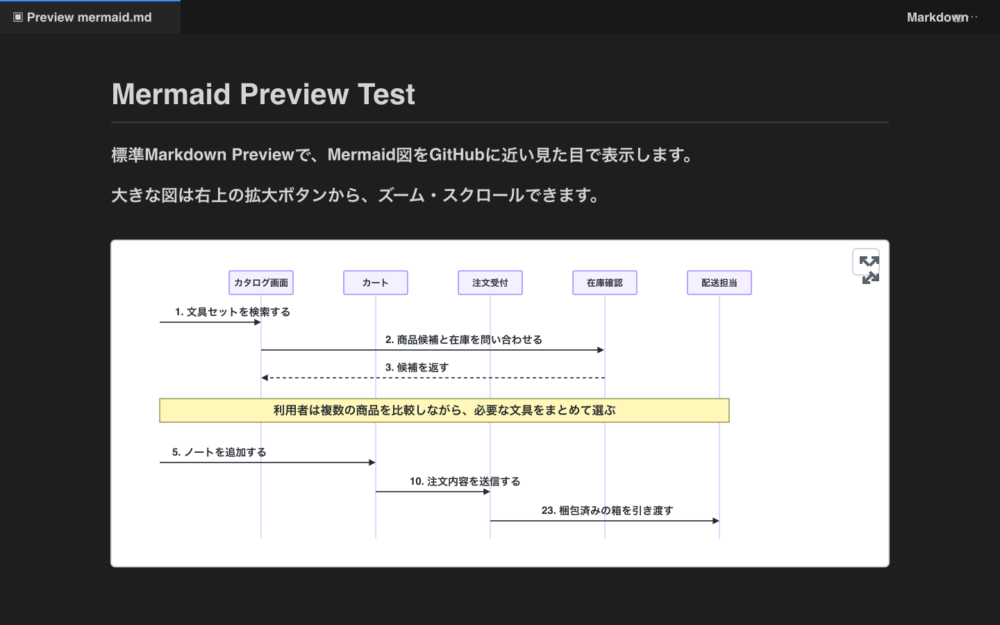
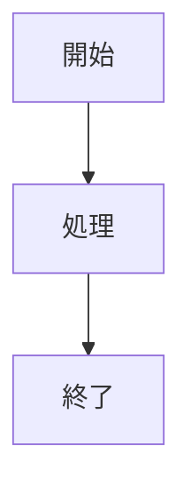

# Ascreit Mermaid Markdown Preview

[](https://marketplace.visualstudio.com/items?itemName=ascreit.vscode-github-markdown-preview)
[](https://marketplace.visualstudio.com/items?itemName=ascreit.vscode-github-markdown-preview)
[](https://marketplace.visualstudio.com/items?itemName=ascreit.vscode-github-markdown-preview)
[](LICENSE)

[English README](README.md)

VS Code / Cursor の標準Markdown Previewで、MermaidをGitHubに近い見た目で表示するための拡張です。

[Install from Marketplace](https://marketplace.visualstudio.com/items?itemName=ascreit.vscode-github-markdown-preview)



Markdownファイルを普通に開き、エディタ右上の `Preview` ボタンまたは標準コマンド `Markdown: Open Preview` を実行すると、この拡張が標準プレビューへCSSとスクリプトを追加します。

## できること

- Mermaid code block を標準Markdown Preview内でGitHub風に表示
- 大きなMermaid図をプレビュー幅に収めて表示
- 図の右上ボタンから拡大モーダルを開き、幅フィット表示、ズーム、スクロールで確認
- 拡大モーダル内でMacトラックパッドのピンチズームや、Macでは `Cmd` + ドラッグ、Windows/Linuxでは `Ctrl` + ドラッグによるパン操作に対応
- MarkdownソースとPreviewをエディタ右上の `Preview` / `Markdown` ボタンで切り替え

## 使い方

1. Markdownファイルを開く
2. エディタ右上の `Preview` ボタンを押す
3. Mermaid図を大きく見たい場合は、図の右上にある拡大ボタンを押す

拡大表示では、最初に図がプレビュー幅へ収まる倍率で表示されます。`+` / `-` ボタンでズームし、`Fit` ボタンで幅フィットへ戻せます。大きな図はスクロール、またはMacでは `Cmd` + ドラッグ、Windows/Linuxでは `Ctrl` + ドラッグで表示位置を動かせます。

プレビューから元のMarkdownへ戻る場合は、プレビュータブ右上の `Markdown` ボタンを押します。

コマンドパレットから開く場合は、以下でも同じです。

```text
Markdown: Open Preview
Markdown: Open Preview to the Side
```

Mermaidは、通常のMarkdownと同じように fenced code block で書きます。

````markdown

````

## インストール

Marketplaceからインストールできます。

[Install from Marketplace](https://marketplace.visualstudio.com/items?itemName=ascreit.vscode-github-markdown-preview)

コマンドパレットからインストールする場合は、`Extensions: Install Extensions` を開いて以下を検索してください。

```text
Ascreit Mermaid Markdown Preview
```

拡張IDで検索する場合は以下です。

```text
ascreit.vscode-github-markdown-preview
```
