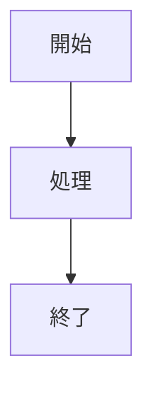

# Ascreit Mermaid Markdown Preview

VS Code / Cursor の標準Markdown Previewで、MermaidをGitHubに近い見た目で表示するための拡張です。

[Install in VS Code](vscode:extension/ascreit.vscode-github-markdown-preview)  
[Open in Marketplace](https://marketplace.visualstudio.com/items?itemName=ascreit.vscode-github-markdown-preview)


Markdownファイルを普通に開き、エディタ右上の `Preview` ボタンまたは標準コマンド `Markdown: Open Preview` を実行すると、この拡張が標準プレビューへCSSとスクリプトを追加します。

## できること

- Mermaid code block を標準Markdown Preview内でGitHub風に表示
- 大きなMermaid図をプレビュー幅に収めて表示
- 図の右上ボタンから拡大モーダルを開き、ズーム、スクロール、Macトラックパッドのピンチ操作で確認
- MarkdownソースとPreviewをエディタ右上の `Preview` / `Markdown` ボタンで切り替え

## 使い方

1. Markdownファイルを開く
2. エディタ右上の `Preview` ボタンを押す
3. Mermaid図を大きく見たい場合は、図の右上にある拡大ボタンを押す

プレビューから元のMarkdownへ戻る場合は、プレビュータブ右上の `Markdown` ボタンを押します。

コマンドパレットから開く場合は、以下でも同じです。

```text
Markdown: Open Preview
Markdown: Open Preview to the Side
```

Mermaidは、通常のMarkdownと同じように fenced code block で書きます。

````markdown

````

動作確認には以下のファイルを使えます。

```text
examples/mermaid.md
```

## インストール

以下のリンクからVS Codeの拡張機能インストール画面を開けます。

[Install in VS Code](vscode:extension/ascreit.vscode-github-markdown-preview)

VS Codeの拡張機能ビューから検索する場合は、以下で検索してください。

```text
Ascreit Mermaid Markdown Preview
```

ローカルのVSIXから試す場合は、VSIXを作成してインストールします。

```bash
npm install
npm run package
```

成功すると、以下のようなファイルが作成されます。

```text
vscode-github-markdown-preview-0.0.2.vsix
```

VS Code / Cursor で以下を実行します。

1. `Cmd + Shift + P` でコマンドパレットを開く
2. `Extensions: Install from VSIX...` を実行する
3. 作成された `.vsix` ファイルを選ぶ
4. `Developer: Reload Window` を実行する

Cursorや別のVS Code互換エディタを使っている場合、ターミナルの `code --install-extension` は通常のVS Codeへインストールされることがあります。その場合は、実際に使うエディタ上で `Extensions: Install from VSIX...` を実行してください。

## Marketplace公開

Marketplaceへの公開は `ascreit.vscode-github-markdown-preview` として行います。
新しいバージョンを公開する場合は、`package.json` の `version` を上げてから公開します。

```bash
npm install
npm run check
npm run package
npm version patch
npx vsce login ascreit
npx vsce publish
```

公開済みのMarketplace URLとVS Code URIは以下です。

```text
https://marketplace.visualstudio.com/items?itemName=ascreit.vscode-github-markdown-preview
vscode:extension/ascreit.vscode-github-markdown-preview
```

## 開発

この拡張は、VS Codeの `markdown.previewScripts` と `markdown.previewStyles` によって標準Markdown Previewへ処理を追加します。

主なファイルは以下です。

- `src/extension.ts`: `Preview` / `Markdown` 切り替えコマンドのTypeScriptソース
- `src/preview.ts`: Markdown Preview内で実行されるブラウザ側スクリプトのTypeScriptソース
- `extension.js`: TypeScriptから生成される拡張ホスト用エントリポイント
- `media/preview.js`: TypeScriptから生成されるMarkdown Preview注入スクリプト
- `media/preview.css`: Markdown PreviewとMermaid表示の見た目を整える
- `media/mermaid.min.js`: Preview内で使うMermaid本体
- `package.json`: Markdown Previewとコマンドへの貢献設定

開発用ウィンドウで確認するには、Cursor / VS Codeでこのリポジトリを開いて `F5` または `Debug: Start Debugging` を実行します。

`Extension Development Host` が開いたら、`examples/mermaid.md` を開いて標準のMarkdown Previewを表示してください。

TypeScriptソースを確認するには以下を実行します。

```bash
npm run check
```

## Mermaidの更新

`media/mermaid.min.js` は `mermaid` npm package のビルド済みファイルを同梱しています。

Mermaidを更新する場合は、`package.json` の `mermaid` バージョンを更新したあと、以下を実行して同梱ファイルを更新してください。

```bash
npm install
cp node_modules/mermaid/dist/mermaid.min.js media/mermaid.min.js
```
