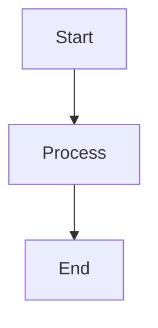

# Ascreit Mermaid Markdown Preview

[](https://marketplace.visualstudio.com/items?itemName=ascreit.vscode-github-markdown-preview)
[](https://marketplace.visualstudio.com/items?itemName=ascreit.vscode-github-markdown-preview)
[](https://marketplace.visualstudio.com/items?itemName=ascreit.vscode-github-markdown-preview)
[](LICENSE)

[Japanese README](README.ja.md)

This extension renders Mermaid diagrams in VS Code and Cursor's built-in Markdown Preview with GitHub-like styling.

[Install from Marketplace](https://marketplace.visualstudio.com/items?itemName=ascreit.vscode-github-markdown-preview)


Open a Markdown file and click the `Preview` button in the editor title bar, or run the built-in `Markdown: Open Preview` command. The extension adds CSS and scripts to the standard Markdown Preview.

## Features

- Render Mermaid code blocks in the standard Markdown Preview with GitHub-like styling.
- Fit large Mermaid diagrams to the preview width.
- Open diagrams in an expanded dialog with fit-to-width display, zoom controls, and scrolling.
- Use trackpad pinch zoom on macOS, or pan in the expanded dialog with `Cmd` + drag on macOS and `Ctrl` + drag on Windows/Linux.
- Switch between Markdown source and preview from the `Preview` / `Markdown` buttons in the editor title bar.

## Usage

1. Open a Markdown file.
2. Click the `Preview` button in the editor title bar.
3. To inspect a Mermaid diagram in a larger view, click the expand button in the diagram's upper-right corner.

The expanded view initially fits the diagram to the preview width. Use the `+` / `-` buttons to zoom, and use the `Fit` button to return to fit-to-width. For large diagrams, move around by scrolling, or by dragging with `Cmd` on macOS and `Ctrl` on Windows/Linux.

To return from the preview to the Markdown source, click the `Markdown` button in the preview tab title bar.

You can also use the built-in commands from the command palette:

```text
Markdown: Open Preview
Markdown: Open Preview to the Side
```

Write Mermaid diagrams as fenced code blocks, just like regular Markdown:

````markdown

````

## Installation

Install from Visual Studio Marketplace:

[Install from Marketplace](https://marketplace.visualstudio.com/items?itemName=ascreit.vscode-github-markdown-preview)

To install from the command palette, open `Extensions: Install Extensions` and search for:

```text
Ascreit Mermaid Markdown Preview
```

You can also search by extension ID:

```text
ascreit.vscode-github-markdown-preview
```
