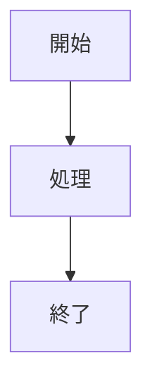

# vscode-github-markdown-preview

VS Code / Cursor の標準Markdown Previewで、MermaidをGitHubに近い見た目で表示するための拡張です。

Markdownファイルを普通に開き、エディタ右上の `Preview` ボタンまたは標準コマンド `Markdown: Open Preview` を実行すると、この拡張が標準プレビューへCSSとスクリプトを追加します。

## 目的

VS Code標準のMarkdown Previewでは、Mermaid図の見た目がGitHub上の表示と異なったり、日本語を含む図で余白やレイアウトが読みづらくなることがあります。

この拡張は、Markdownを書きながらGitHubに近い状態でMermaid図を確認できるようにすることを目的としています。

## 使い方

1. Markdownファイルを開く
2. エディタ右上の `Preview` ボタンを押す

Markdownソースからプレビューへ切り替える場合は、エディタ右上の `Preview` ボタンを押します。プレビューから元のMarkdownへ戻る場合は、プレビュータブ右上の `Markdown` ボタンを押します。

コマンドパレットから開く場合は、以下でも同じです。

```text
Markdown: Open Preview
Markdown: Open Preview to the Side
```

Mermaidは、通常のMarkdownと同じように fenced code block で書きます。

````markdown

````

動作確認には以下のファイルを使えます。

```text
examples/mermaid.md
```

## インストール

この拡張は、まだMarketplaceには公開していません。

VSIXを作成してインストールします。

```bash
npm install
npm run package
```

成功すると、以下のようなファイルが作成されます。

```text
vscode-github-markdown-preview-0.0.1.vsix
```

VS Code / Cursor で以下を実行します。

1. `Cmd + Shift + P` でコマンドパレットを開く
2. `Extensions: Install from VSIX...` を実行する
3. 作成された `.vsix` ファイルを選ぶ
4. `Developer: Reload Window` を実行する

Cursorや別のVS Code互換エディタを使っている場合、ターミナルの `code --install-extension` は通常のVS Codeへインストールされることがあります。その場合は、実際に使うエディタ上で `Extensions: Install from VSIX...` を実行してください。

## 開発

この拡張は、VS Codeの `markdown.previewScripts` と `markdown.previewStyles` によって標準Markdown Previewへ処理を追加します。

主なファイルは以下です。

- `media/preview.js`: Markdown Preview内の `mermaid` code block をMermaid SVGへ変換する
- `media/preview.css`: Markdown PreviewとMermaid表示の見た目を整える
- `media/mermaid.min.js`: Preview内で使うMermaid本体
- `src/extension.ts`: `Preview` / `Markdown` 切り替えコマンドのTypeScriptソース
- `extension.js`: TypeScriptから生成される拡張ホスト用エントリポイント
- `package.json`: Markdown Previewとコマンドへの貢献設定

開発用ウィンドウで確認するには、Cursor / VS Codeでこのリポジトリを開いて `F5` または `Debug: Start Debugging` を実行します。

`Extension Development Host` が開いたら、`examples/mermaid.md` を開いて標準のMarkdown Previewを表示してください。

TypeScriptソースを確認するには以下を実行します。

```bash
npm run check
```

## Mermaidの更新

`media/mermaid.min.js` は `mermaid` npm package のビルド済みファイルを同梱しています。

Mermaidを更新する場合は、`package.json` の `mermaid` バージョンを更新したあと、以下を実行して同梱ファイルを更新してください。

```bash
npm install
cp node_modules/mermaid/dist/mermaid.min.js media/mermaid.min.js
```
