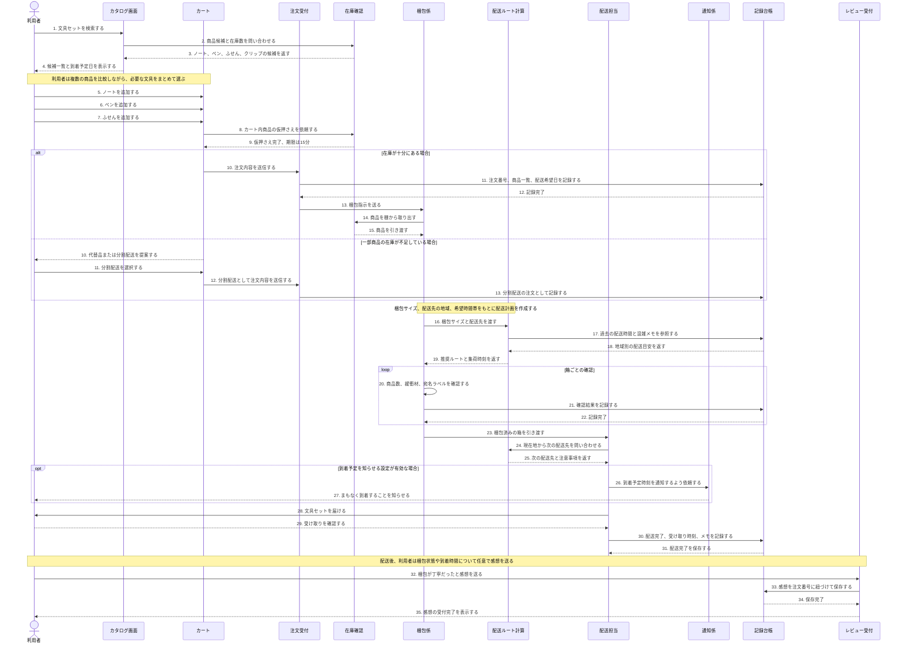

# Mermaid Preview Test

このファイルは、大きく複雑な Mermaid 図が標準 Markdown Preview で読みやすく表示されるかを確認するためのサンプルです。

実在のシステム名、組織名、サービス名には依存しない架空の「文具配送」フローです。

```mermaid
sequenceDiagram
    actor User as 利用者
    participant Catalog as カタログ画面
    participant Cart as カート
    participant Order as 注文受付
    participant Stock as 在庫確認
    participant Pack as 梱包係
    participant Route as 配送ルート計算
    participant Driver as 配送担当
    participant Notice as 通知係
    participant Ledger as 記録台帳
    participant Review as レビュー受付

    User->>Catalog: 1. 文具セットを検索する
    Catalog->>Stock: 2. 商品候補と在庫数を問い合わせる
    Stock-->>Catalog: 3. ノート、ペン、ふせん、クリップの候補を返す
    Catalog-->>User: 4. 候補一覧と到着予定日を表示する

    Note over User,Cart: 利用者は複数の商品を比較しながら、必要な文具をまとめて選ぶ

    User->>Cart: 5. ノートを追加する
    User->>Cart: 6. ペンを追加する
    User->>Cart: 7. ふせんを追加する
    Cart->>Stock: 8. カート内商品の仮押さえを依頼する
    Stock-->>Cart: 9. 仮押さえ完了、期限は15分

    alt 在庫が十分にある場合
        Cart->>Order: 10. 注文内容を送信する
        Order->>Ledger: 11. 注文番号、商品一覧、配送希望日を記録する
        Ledger-->>Order: 12. 記録完了
        Order->>Pack: 13. 梱包指示を送る
        Pack->>Stock: 14. 商品を棚から取り出す
        Stock-->>Pack: 15. 商品を引き渡す
    else 一部商品の在庫が不足している場合
        Cart-->>User: 10. 代替品または分割配送を提案する
        User->>Cart: 11. 分割配送を選択する
        Cart->>Order: 12. 分割配送として注文内容を送信する
        Order->>Ledger: 13. 分割配送の注文として記録する
    end

    Note over Pack,Route: 梱包サイズ、配送先の地域、希望時間帯をもとに配送計画を作成する

    Pack->>Route: 16. 梱包サイズと配送先を渡す
    Route->>Ledger: 17. 過去の配送時間と混雑メモを参照する
    Ledger-->>Route: 18. 地域別の配送目安を返す
    Route-->>Pack: 19. 推奨ルートと集荷時刻を返す

    loop 箱ごとの確認
        Pack->>Pack: 20. 商品数、緩衝材、宛名ラベルを確認する
        Pack->>Ledger: 21. 確認結果を記録する
        Ledger-->>Pack: 22. 記録完了
    end

    Pack->>Driver: 23. 梱包済みの箱を引き渡す
    Driver->>Route: 24. 現在地から次の配送先を問い合わせる
    Route-->>Driver: 25. 次の配送先と注意事項を返す

    opt 到着予定を知らせる設定が有効な場合
        Driver->>Notice: 26. 到着予定時刻を通知するよう依頼する
        Notice-->>User: 27. まもなく到着することを知らせる
    end

    Driver->>User: 28. 文具セットを届ける
    User-->>Driver: 29. 受け取りを確認する
    Driver->>Ledger: 30. 配送完了、受け取り時刻、メモを記録する
    Ledger-->>Driver: 31. 配送完了を保存する

    Note over User,Review: 配送後、利用者は梱包状態や到着時間について任意で感想を送る

    User->>Review: 32. 梱包が丁寧だったと感想を送る
    Review->>Ledger: 33. 感想を注文番号に紐づけて保存する
    Ledger-->>Review: 34. 保存完了
    Review-->>User: 35. 感想の受付完了を表示する
```
